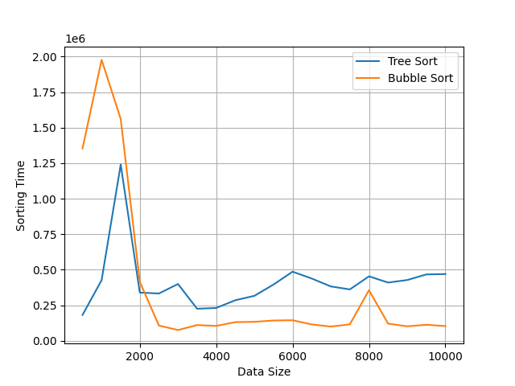

## Project Description: 
**Binary Search Tree**: This project was developed as part of a university course on Data Structures and Algorithms. It focuses on implementing and comparing sorting algorithms (Tree Sort and Bubble Sort) using a Binary Search Tree (BST). Additionally, the project includes performance measurement and visualization of execution times using Python.

## Features:
1. Implementation of a BST with methods to insert elements, get the height of the BST and search an element x in the BST.
2. Traversals: InOrder, PreOrder & PostOrder traversal methods were added to retrieve elements from the BST based on the type of traversal.
3. Implementation of Two sorting algorithms: Tree Sort & Bubble Sort 
4. Performance Measurement: Measure and compare the execution time of Tree Sort and Bubble Sort. Results are then saved to csv files.
5. Data Visualization: Python script to read the csv files and plot a chart comparing the performances of the two algorithms.

## Technologies Used:
- Java
- Python
- Python Libraries: Matplotlib, Numpy & Pandas

## Instructions for Use:
**Java Implementation:**
1. Clone this repository and navigate to the **src/** folder
2. Compile and run the Main.java file (You experiment with the various methods from the BinarySearchTree.java file)
3. The execution time of the sorting algorithms will be saved in **treesort_time_data.csv** and **bubblesort_time_data.csv**

**Python Script**
1. Make sure you have python and the required libraries (listed above) installed
2. Run the python script **plot_chart.py** to visualize the execution times, a sample graph is pictured below:

Feel free to contribute, report issues, or suggest enhancements on GitHub to improve this project.